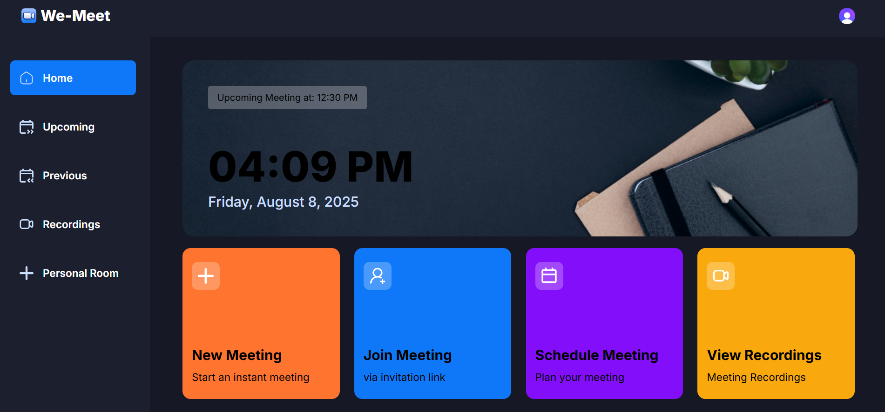
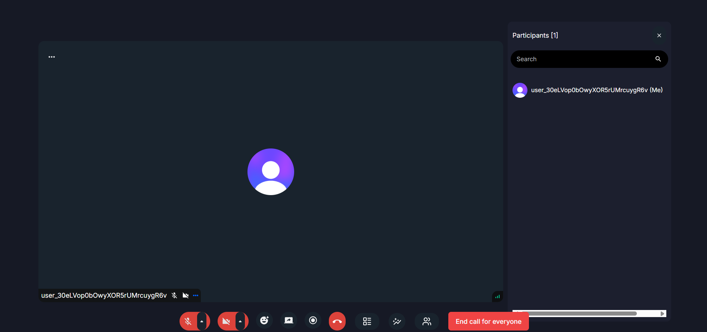
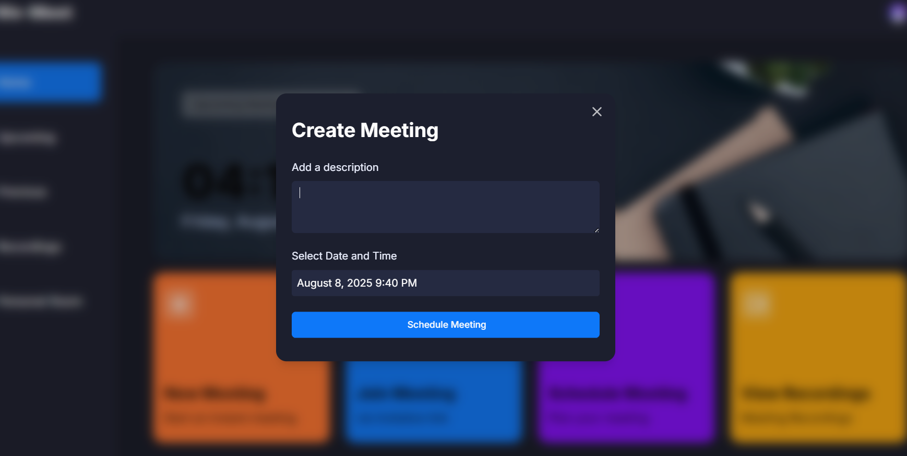
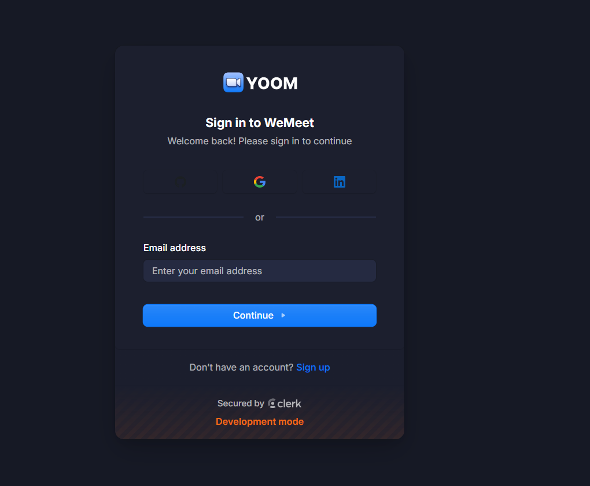

# We Meet

A real-time virtual meeting app built with **Next.js**, **Clerk**, **Stream**, and **Socket.io**.

 **Live App**: [we-meet-iota.vercel.app](https://we-meet-iota.vercel.app)

---

##  About

**We Meet** is a clean and fast meeting platform where users can create or join rooms with secure authentication and real-time video chat — perfect for remote collaboration or casual meetups.

---

##  Features

-  Secure login via [Clerk](https://jsm.dev/zoom-clerk)
-  Real-time video & audio via [Stream](https://jsm.dev/zoom-stream)
-  Smart utilities with [WebStorm](https://jsm.dev/zoom-webstorm)
-  Room-based user sessions via Socket.io
-  Fully responsive UI
-  Fast, minimal, modern design

---


###  Home Page


###  Meeting Room


###  Meeting Scheduler


###  Authentication Page



##  Tech Stack

- **Frontend:** [Next.js](https://nextjs.org/)
- **Authentication:** [Clerk](https://jsm.dev/zoom-clerk)
- **Video API:** [Stream](https://jsm.dev/zoom-stream)
- **Real-Time:** [Socket.io](https://socket.io/)
- **AI Tools:** [WebStorm](https://jsm.dev/zoom-webstorm)
- **Styling:** Tailwind CSS
- **Hosting:** [Vercel](https://vercel.com/)

---

### Installation

```bash
# Clone the repo
git clone https://github.com/siddhantrambhad/We-Meet.git
cd We-Meet

# Install dependencies
npm install

# Start the app
npm run dev
